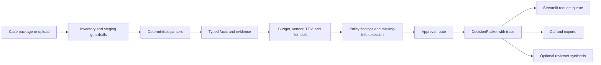

# Architecture

## Product Shape

This prototype is a deterministic vendor onboarding triage workflow with a human review cockpit. It is intentionally not an autonomous approval agent.

The system ingests a mixed vendor package, normalizes source facts into typed schemas, runs deterministic policy/tool checks, preserves evidence, and produces a structured decision packet for a procurement owner.

## Flow

## Key Modules

| Module | Responsibility |
| --- | --- |
| `vendor_agent.inventory` | Verifies expected source files exist for each case. |
| `vendor_agent.parsers` | Parses Excel intake, quote CSV, contract PDF, security questionnaire, vendor email, and policy docs. |
| `vendor_agent.schemas` | Defines the product contract for evidence, facts, findings, approval route, drafts, trace, and decision packet. |
| `vendor_agent.tools` | Implements deterministic tool-like checks: budget lookup, duplicate vendor lookup, TCV calculation, and risk classification. |
| `vendor_agent.policies` | Applies deterministic procurement, finance, legal, security, and vendor-risk rules. |
| `vendor_agent.synthesis` | Creates a reviewer-facing synthesis bundle from the validated decision packet and optionally calls OpenAI for structured synthesis. |
| `vendor_agent.tracing` | Records workflow steps, inputs, outputs, timing, requirement IDs, and evidence IDs. |
| `vendor_agent.pipeline` | Orchestrates one case into a `DecisionPacket`. |
| `vendor_agent.evaluator` | Runs all seeded cases against expected baselines. |
| `vendor_agent.uploads` | Stages ad hoc reviewer uploads into canonical case folders, validates package shape, recognizes optional support artifacts, and blocks ambiguous uploads. |
| `app.py` | Streamlit case queue and review cockpit over the same `DecisionPacket` contract. |

## Why Deterministic First

Procurement onboarding has explicit policies, financial thresholds, evidence requirements, and high-risk human approvals. The model should not own those decisions.

The current prototype uses deterministic code for:

- parsing source files
- extracting facts
- calculating ACV, one-time fees, and total contract value
- checking budget
- checking existing vendors
- classifying preliminary risk
- detecting missing information
- determining approval route
- preserving evidence and trace

An LLM can be used for concise summaries or better draft wording, but only after deterministic facts and policy outputs exist. Model output validates against the same schemas and must not override policy checks.

The current implementation includes both deterministic synthesis and an optional live OpenAI provider. `SynthesisBundle` is generated from the validated `DecisionPacket`, validates cited evidence IDs and prohibited action language, and fails closed to deterministic synthesis when provider calls or validation fail.

## Decision Packet Contract

Each run emits:

- `case_id`
- `status`
- `status_reason`
- `summary`
- `synthesis`
- normalized `facts`
- `missing_information`
- policy `findings`
- `approval_route`
- draft messages
- source `evidence`
- workflow `trace`

This structure is used by both CLI and Streamlit, so UI behavior and reproducible command-line output stay aligned.

## Evidence Model

Every extracted fact and policy finding links to evidence where practical:

- source file
- source type
- location such as sheet cell, CSV row, PDF page, markdown section, or email body
- snippet
- parsed value

The trace also carries evidence IDs for parser, tool, policy, approval-route, and draft steps.

## Human-In-The-Loop Boundary

The system may:

- summarize the vendor request
- identify missing information
- recommend review routing
- create draft vendor follow-ups
- create draft internal notes
- export packet and trace
- export a triage workbook for human routing

The system must not:

- approve a vendor
- commit company spend
- accept legal terms
- send external communications
- bypass Procurement, Finance, Legal, Security, or executive approvals

## Current Coverage

The deterministic pipeline currently covers:

- `case_001`: Northstar Analytics, high-risk SaaS/customer-data AI vendor, duplicate vendor review, missing SOC 2 Type II and DPA, data-use opt-out confirmation needed.
- `case_002`: Workspace Depot, low-risk office-supplies renewal, setup documents missing, no unnecessary Legal/Security escalation.
- `case_003`: TalentPulse AI, high-risk employee-data AI vendor, budget shortfall, missing legal/security materials, AI training opt-out issue, CFO/Legal/Security/executive route.

## Upload Guardrails

Upload mode is intentionally a staging layer, not a separate business workflow. It accepts the same five required inputs as the exercise package and then calls `run_case()` on the canonical staged folder.

Guardrails currently include:

- file count and total size limits
- safe zip expansion with path traversal checks
- minimum confidence thresholds for required-file role matching
- content-aware checks for intake workbooks, quote CSV headers, security questionnaire sections, vendor emails, and PDFs
- blocking mixed-vendor packages when required files appear to come from multiple case prefixes
- explicit optional support-artifact mapping for SOC 2, DPA, subprocessors, tax form, vendor setup form, AI training opt-out, and statement of work
- checklist updates when optional support artifacts are uploaded

Policy documents and arbitrary markdown/text files are treated as unmatched unless they clearly match a required or optional artifact role.

## Sample Upload Packets

`data/sample-upload-packets` contains generated reviewer test packages and matching zips:

- valid low-risk operational vendor with setup docs
- high-risk AI vendor with support artifacts
- prompt-injection vendor email
- policy-document decoy in place of questionnaire
- mixed-vendor package
- malformed quote CSV

The packets are generated by `scripts/build_sample_upload_packets.py` so they can be refreshed from the synthetic candidate package.

## Streamlit Information Architecture

The app starts with a procurement-style request queue instead of opening directly on one sample case. The queue shows request ID, vendor, status, risk, budget status, missing-information count, next owner, source, and a compact open action.

The case detail page is scan-first:

- navigation back to the request queue
- status banner
- key metrics
- decision, next action, and owner
- reviewer brief
- required follow-up with owner, reason, and evidence
- human review route
- draft vendor follow-up and internal note behind disclosure
- audit details behind disclosure, including context, findings, evidence, workflow, trace, and exports
- upload intake details behind disclosure for uploaded requests

The UI intentionally keeps implementation details out of the primary review path. Function calls remain available in trace/workflow disclosures, while the visible request page uses procurement language and avoids nonfunctional controls.
