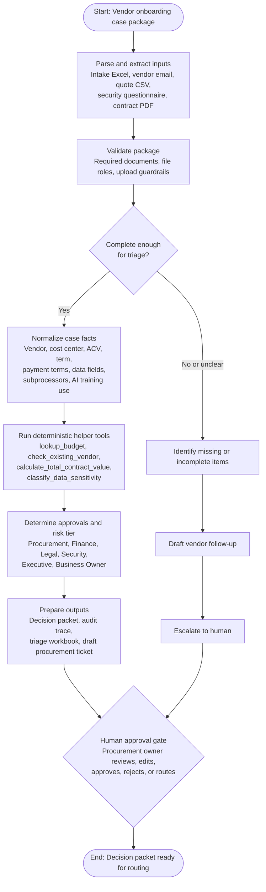
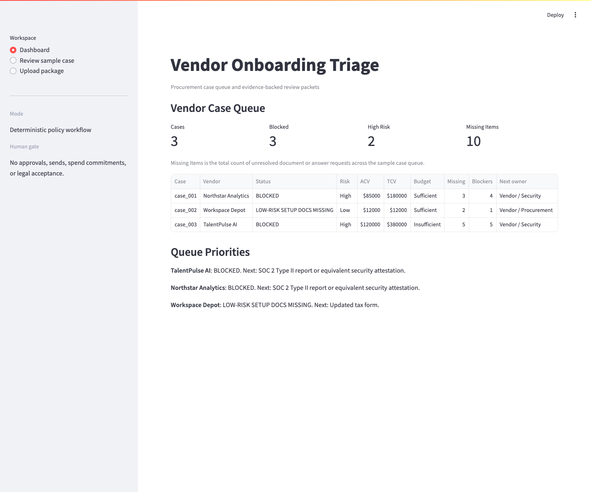
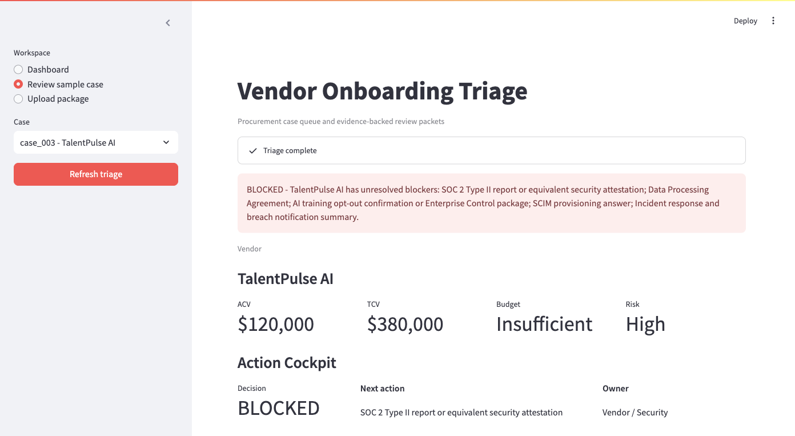
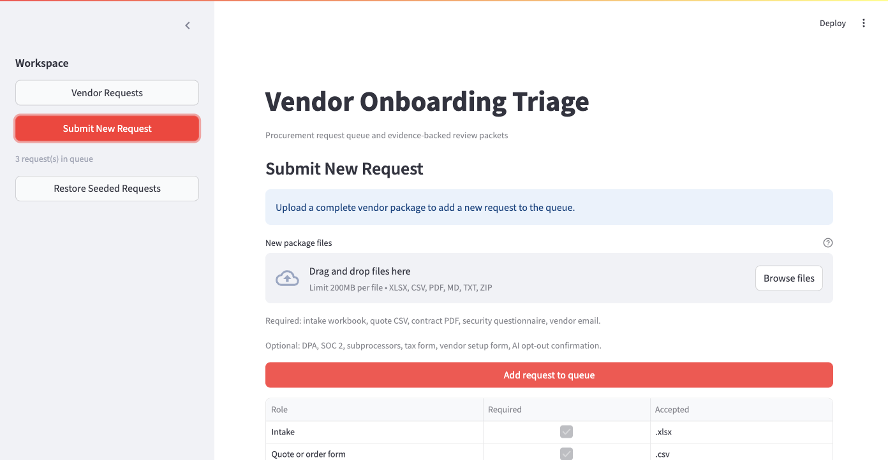

# Accelerant Vendor Onboarding Agent

Prototype for the Accelerant Applied AI take-home technical exam.

The app is a procurement-owner triage assistant. It reads a synthetic vendor onboarding package, normalizes the source files into a structured decision packet, runs deterministic policy and tool checks, identifies missing information, recommends the required human review path, and presents the result in a deployed Streamlit workflow.

- Deployed app: [accelerant-vendor-app-agent-5rcbcuzjbmdlpyenpfeay9.streamlit.app](https://accelerant-vendor-app-agent-5rcbcuzjbmdlpyenpfeay9.streamlit.app/)
- Repository: [github.com/nicolairobles/accelerant-vendor-onboarding-agent](https://github.com/nicolairobles/accelerant-vendor-onboarding-agent)

## What To Review

1. Open the deployed app.
2. Start on `Vendor Requests`.
3. Open `TalentPulse AI` to see the most complex seeded case: high-risk AI vendor, insufficient budget, legal/security/finance routing, and missing vendor documents.
4. Review `Decision`, `Required Vendor Follow-up`, `Internal Review Route`, and `Reviewer Brief`.
5. Open `Audit details` for evidence, policy findings, workflow trace, and exports.
6. Use `Submit New Request` with `data/sample-upload-packets/zips/net_new_supportflow_complete.zip` to add a new vendor request to the queue.

## Architecture

The core design choice is deterministic policy decisioning with optional LLM synthesis only after a validated decision packet exists. The workflow mirrors the process-flow image from the exercise package: validate the package first, split incomplete requests into follow-up, and route complete requests through deterministic tools before the human approval gate.



More detail: [ARCHITECTURE.md](ARCHITECTURE.md) and [PRODUCTIONIZATION.md](PRODUCTIONIZATION.md).

## Human-In-The-Loop Boundary

The system may summarize requests, identify missing information, recommend review routing, draft follow-up text, and export an audit packet.

The system must not approve a vendor, commit spend, accept legal terms, send external communications, or bypass Procurement, Finance, Legal, Security, or executive approvals.

## Repository Map

| Path | Purpose |
| --- | --- |
| `app.py` | Streamlit reviewer app over the decision packet contract. |
| `vendor_agent/` | Parsers, schemas, deterministic tools, policy checks, synthesis, tracing, upload staging, and pipeline orchestration. |
| `data/source-package/` | Synthetic exercise package and policy/source materials. |
| `data/sample-upload-packets/` | Generated upload packets for manual and regression testing. |
| `evals/seed-cases.json` | Expected outputs for the three seeded cases. |
| `tests/` | Unit, regression, upload, synthesis, and Streamlit app tests. |
| `docs/requirements/acceptance-matrix.md` | Requirement-to-verification matrix. |
| `docs/quality/deployment-final-qa.md` | Final deployed QA evidence. |
| `docs/research/llm-synthesis-assessment.md` | LLM synthesis boundary and eval rationale. |
| `.github/workflows/ci.yml` | Compile, test, and deterministic eval CI gate. |

## Setup

```bash
python -m venv .venv
source .venv/bin/activate
python -m pip install -r requirements.txt
```

Python 3.11 is the intended runtime for local reproducibility and deployment compatibility.

## Commands

```bash
python3 -m vendor_agent.cli run \
  --case data/source-package/Candidate_package/cases/case_003 \
  --out outputs/case_003.json

python3 -m vendor_agent.cli eval

python3 -m pytest -q

streamlit run app.py
```

The CLI writes:

- `outputs/<case_id>.json` - structured decision packet
- `outputs/<case_id>.trace.json` - deterministic workflow trace
- `evals/reports/eval_report.json` - all-case regression eval report

## Upload Testing

The Streamlit app supports uploading one new single-vendor package as multiple files or as a zip. Required files:

- intake workbook (`.xlsx`)
- quote CSV (`.csv`)
- contract PDF (`.pdf`)
- security questionnaire (`.md`)
- vendor email (`.txt`)

Optional support artifacts include DPA, SOC 2, subprocessor list, tax form, vendor setup form, and AI training opt-out confirmation. Uploaded files create a new request record in Streamlit session state and do not mutate the seeded exam requests.

Sample zips are under `data/sample-upload-packets/zips/`:

- `valid_low_risk_ops_complete.zip`
- `high_risk_ai_with_support_artifacts.zip`
- `net_new_supportflow_complete.zip`
- `guardrail_prompt_injection_email.zip`
- `guardrail_policy_doc_decoy_incomplete.zip`
- `invalid_mixed_vendor_case_prefixes.zip`
- `invalid_bad_quote_schema.zip`

Regenerate them with:

```bash
python3 scripts/build_sample_upload_packets.py
```

## Screenshots

### Vendor Request Queue



### Productized Vendor Request



### Submit New Request



## LLM Synthesis Stance

Policy decisions are deterministic. The optional OpenAI-backed synthesis layer is limited to reviewer summaries and draft text generated from the validated `DecisionPacket`. It validates structured output, evidence citations, and prohibited approval/send/commitment language, then fails closed to deterministic synthesis when provider config is absent or validation fails.

Enable live synthesis with `OPENAI_SYNTHESIS_PROVIDER=openai`, `OPENAI_API_KEY`, and optionally `OPENAI_SYNTHESIS_MODEL`. The app works without these values.

## QA Status

- Latest CI: compile, unit tests, and deterministic evals pass.
- Local test suite: `37 passed`.
- Deterministic eval: `3/3` seeded cases pass.
- Deployed smoke: request queue, request detail, submit/upload path, delete, and restore-seeded flows passed.

See [docs/quality/deployment-final-qa.md](docs/quality/deployment-final-qa.md).

## Submission Sharing

The exercise package states that the company names, people, data, and policies are synthetic. This repository is public for frictionless Accelerant review. No API keys, credentials, or real vendor data should be committed.
